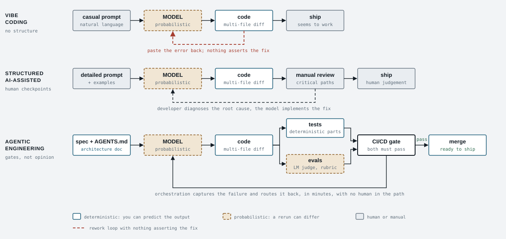

<h1 align="center">agentic-gates</h1>

<p align="center">
  <b>Deterministic gates for the agentic-engineering SDLC.</b><br>
  Spec, tests, evals, review, handoff. Pass or fail, with evidence. Any coding agent. No model in the loop.
</p>

<p align="center">
  <a href="https://github.com/Jimmycarroll2021/The-New-SDLC-With-Vibe-Coding/actions/workflows/agentic-gates.yml"></a>
  
  
  
  <a href="LICENSE"></a>
</p>

<p align="center">
  
</p>

The ochre box is the same in every row: same model, same non-determinism. Everything that changes
is teal, and all of it is deterministic. **agentic-gates is the teal.** It makes the bottom row
enforceable in any repository, for any agent, in about five minutes.

```
  PASS  G0  spec: exists, complete, tier matches branch
  PASS  G1  context: rule file present, bounded, versioned
  PASS  G2  tests: touched alongside source, and passing
  N/A   G3  evals: AI surface scored against a rubric
  PASS  G4  review: no secrets, no hallucinated dependencies
  FAIL  G5  handoff: agent run is recorded
         - handoffs/HANDOFF-0012.md: field 'Reviewer' missing or placeholder

GATE FAILURE: the change is not ready
```

A gate says pass or fail and shows why. It never says "consider".

## Why

Google's May 2026 paper *The New SDLC With Vibe Coding* argues that what separates a throwaway
prototype from production software is not the model or the prompt. It is how much deterministic
structure surrounds the model: tests for the deterministic parts, evals for the probabilistic parts,
gates that fail closed, and failures routed back to the agent automatically. It also observes that
most agent failures, examined honestly, are configuration failures.

That is a good argument and an unenforced one. This repository enforces it.

- **Gates, not opinion.** Six checks, each a pure function of the diff and a config file, each
  returning pass, fail or not-applicable with evidence. There is no skip flag anywhere.
- **Risk tier from the branch name.** `proto/*` gets the secrets check only. `feature/*` gets all
  six. The paper's "make the boundary explicit" is a table in `agentic.toml`.
- **The failure loop is built in.** `loop.py` runs your agent, runs the gates, and sends the
  report back to the agent until it passes or only the human `Reviewer:` field remains.
- **Any agent.** `AGENTS.md` is the single rule file; `CLAUDE.md` and `GEMINI.md` are one line
  each. Codex reads it natively. The gate runner never calls a model.
- **Nothing to install.** Python 3.11+ standard library and git. Runs identically in a pre-commit
  hook, locally, and in CI.

## Quick start

```sh
# in a clone of this repo, next to your project
cp -r agentic-gates/.agentic  your-repo/
cp    agentic-gates/agentic.toml agentic-gates/CLAUDE.md agentic-gates/GEMINI.md  your-repo/
cp    agentic-gates/.agentic/templates/AGENTS.template.md  your-repo/AGENTS.md
mkdir -p your-repo/specs your-repo/handoffs your-repo/.github/workflows
cp    agentic-gates/.github/workflows/agentic-gates.yml  your-repo/.github/workflows/

cd your-repo
#  edit agentic.toml: [paths] source/tests/ai_surface, [tests].command, evals.allow_stub_target = false
#  edit AGENTS.md: fill Stack and Conventions (ten lines is enough to start)
python .agentic/hooks/install_hooks.py         # pre-commit hook
cp .agentic/templates/SPEC.md specs/SPEC-0001-first-change.md
python .agentic/gate.py
```

Then protect `main` on GitHub: require a pull request and the **`gates`** status check. Without
that, a direct push meets only the hook's two cheap gates, and the other four are decoration.

## The gates

| Gate | Fails when | The paper's words |
|---|---|---|
| **G0 spec** | no `SPEC-NNNN` referenced; sections missing (Architecture included); placeholders left; spec tier below branch tier | "formal specs, architecture docs"; "architecture remains the most human-centric phase" |
| **G1 context** | `AGENTS.md` missing, over the line cap, missing a section, untracked, or leaking a secret | "start with ten lines"; "treat AGENTS.md as code" |
| **G2 tests** | source changed without a test change, or the test command fails | "tests verify the deterministic parts" (G2 proves *alongside*; a diff cannot prove *before*) |
| **G3 evals** | AI-surface change below the pass rate, too few cases, no rubric, or a stub target | "evals verify the parts that are not deterministic"; "an eval without a rubric measures nothing" |
| **G4 review** | secret pattern in an added line; `.env`/`.pem` in the diff; an import that is not stdlib, not local, not declared, or declared but resolving to nothing in the environment | "check imports for real packages"; the hook that blocks a hard-coded password |
| **G5 handoff** | no `handoffs/HANDOFF-*.md` in the change, or a required field is a placeholder | "traces of every agent run"; "clear handoff protocols" |
| **G6 integrity** | the change edits `agentic.toml`, `.agentic/` or a CI definition that runs the gate, without a spec that declares framework maintenance; `--tier` is used to lower the tier; or no base ref resolves | a control point an agent can rewrite is not a control point |

| Tier | Default branches | Gates |
|---|---|---|
| prototype | `proto/*` `spike/*` `sandbox/*` | G4 |
| internal | `internal/*` `tooling/*` `docs/*` | G1 G2 G4 |
| production | `main` `release/*` `feature/*` `fix/*` and anything else | all six |

**G6 sits on top of that table, at every tier and every stage.** It is not listed in
`[tiers.required]` and has no key of its own, because a gate that detects edits to `agentic.toml`
cannot be switched off by editing `agentic.toml`.

There is no `--skip`. If a gate should not apply, the work is on the wrong branch - and the branch
name is checked against the diff rather than believed: a prototype- or internal-tier branch whose
change set touches `paths.source` is judged at production tier instead. `--tier` raises the tier,
never lowers it. In CI the policy itself is read from the merge base, so a pull request that relaxes
a rule is judged by the rule it replaces, unless it declares framework maintenance in the spec it
references.

Full detail per gate, with what each one deliberately does not do: [`docs/GATES.md`](docs/GATES.md).

## The loop

```sh
python .agentic/loop.py SPEC-0012
```

Sends the spec and `AGENTS.md` to the agent in `[loop].agent_command`, runs the gates, and on
failure sends the report back. Stops on `all_gates_pass`, on `ready_for_human_review` (only the
blank `Reviewer:` remains), or after `max_iterations` with exit code 2. Every prompt, agent log and
gate report is kept under `.agentic/runs/<run-id>/`, so the trajectory is reviewable afterwards.

```toml
[loop]
agent_command = "claude -p --permission-mode acceptEdits"   # or
agent_command = "codex exec --full-auto -"                 # or
agent_command = "gemini -p -"                              # or anything that reads a prompt
```

## CI and CD

`.github/workflows/agentic-gates.yml` has two jobs. **`gates`** runs on every pull request (diff
against the target branch) and every push to `main` (whole-tree audit). **`deploy`** runs only after
`gates` passes on `main`, binds to the `production` environment so a named reviewer must approve,
downloads the gate report, refuses if it is not `ok`, and then runs your deploy step. The shipped
deploy step is an echo; the wiring is the point.

## Evals are a contract, not a runner

G3 runs whatever command you configure and reads one JSON file. The shape is in
[`.agentic/evals/README.md`](.agentic/evals/README.md): case count, overall pass rate, and per
dimension a pass rate and a rubric. The shipped `example_runner.py` honours it with no model at
all, and G3 rejects its stub result in a real repository. Plug in an LM judge through
`AGENTIC_EVAL_JUDGE`. Replace the runner entirely if you like. Keep the shape.

## What it deliberately does not do

- Measure coverage, lint or type-check. Put those in `tests.command`.
- Read PR descriptions. Everything checked is in the repository, so hook, local and CI agree.
- Decide what "correct" means for your AI surface. That rubric is the one thing the paper says
  only you can write.

## Contributing

This repository runs on its own gates. Branch as `feature/SPEC-NNNN-slug` or `fix/SPEC-NNNN-slug`,
write or reference a spec, open a pull request, and the `gates` check decides. `main` does not accept
direct pushes. If you find a way through a gate that should not exist, that is the most valuable
issue you can open.

If it stopped a bad merge for you, a star helps the next person find it.

## Provenance

Built from *The New SDLC With Vibe Coding: From ad-hoc prompting to Agentic Engineering*
(Addy Osmani, Shubham Saboo, Sokratis Kartakis, Google, May 2026), specifically its agentic-engineering
column, its harness section and its "where to start" lists. Each gate cites the passage it enforces
in [`docs/GATES.md`](docs/GATES.md). The repository's own specs are in [`specs/`](specs/) and it
passes its own gates. MIT licensed.
